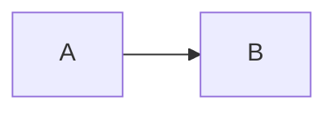

# Code block fixtures

Plain JavaScript:

```js
const a = 1;
function greet(name) {
  return `hi ${name}`;
}
```

Highlight, collapse, and a title:

```ts {1,3-4} [6-7] title="app.ts"
import { a } from './a';
const b: number = 2;
export function c() {
  return a + b;
}
// hidden
// also hidden
console.log(c());
```

Diff overlay:

```json diff
{
-  "version": "1.0.0",
+  "version": "1.1.0",
   "name": "pkg"
}
```

Escaped component tags:

```mdx escape
<Tabs>
  <TabItem label="One">content</TabItem>
</Tabs>
```

Shell session with continuations and quotes:

```shell-session
npm install
$ already prompted
# root prompt
curl -X POST \
  -H 'Content-Type: application/json' \
  https://example.com
echo 'a multi
line quote'
echo done

after blank
```

Aliased language:

```sh {2}
echo one
echo two
```

No language:

```
just text <b>not bold</b>
```

Excluded language:



Inline `code` stays inline.
